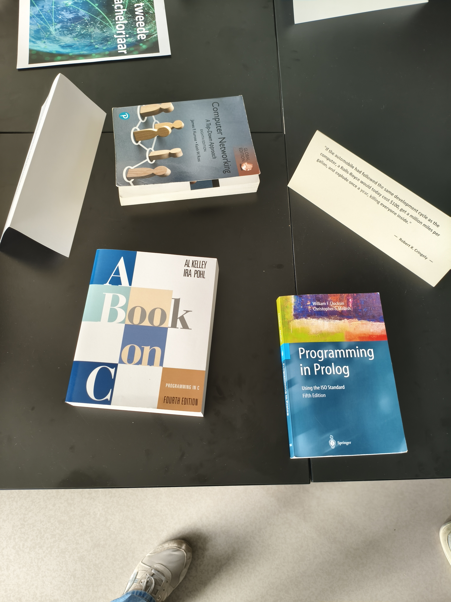
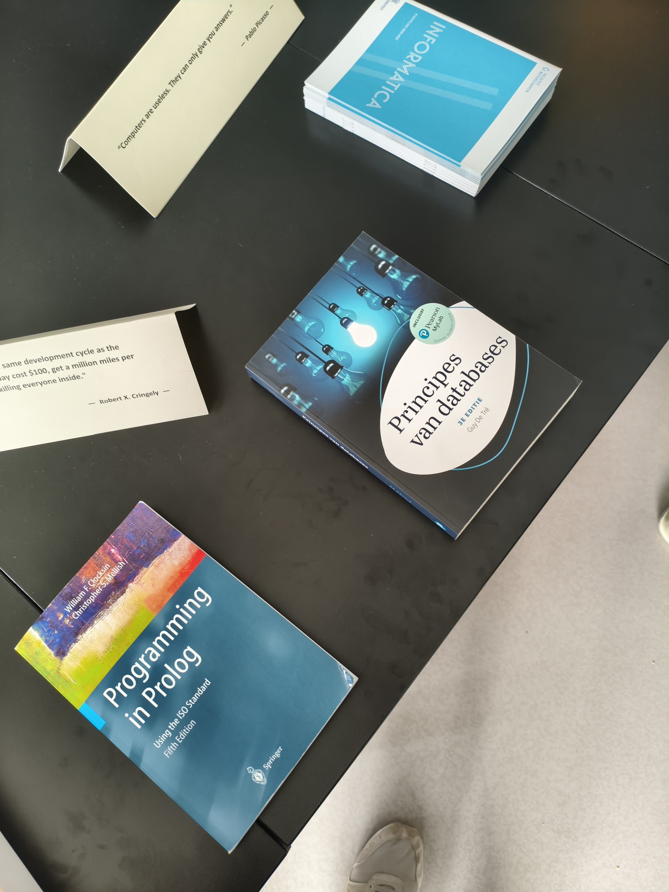
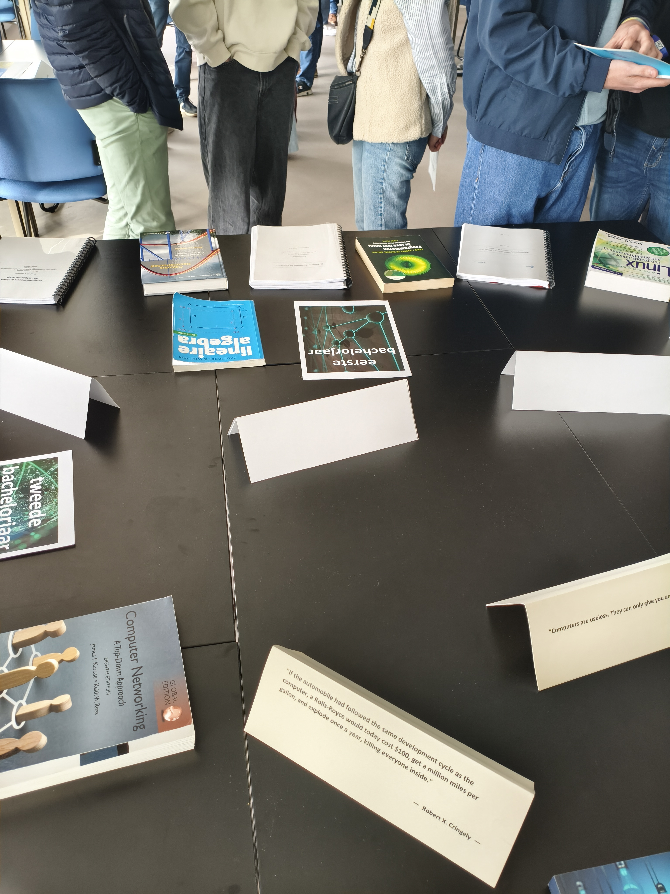
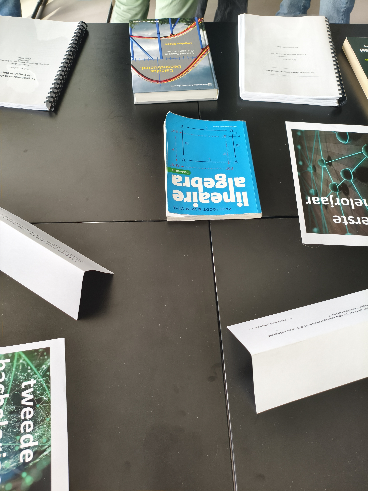
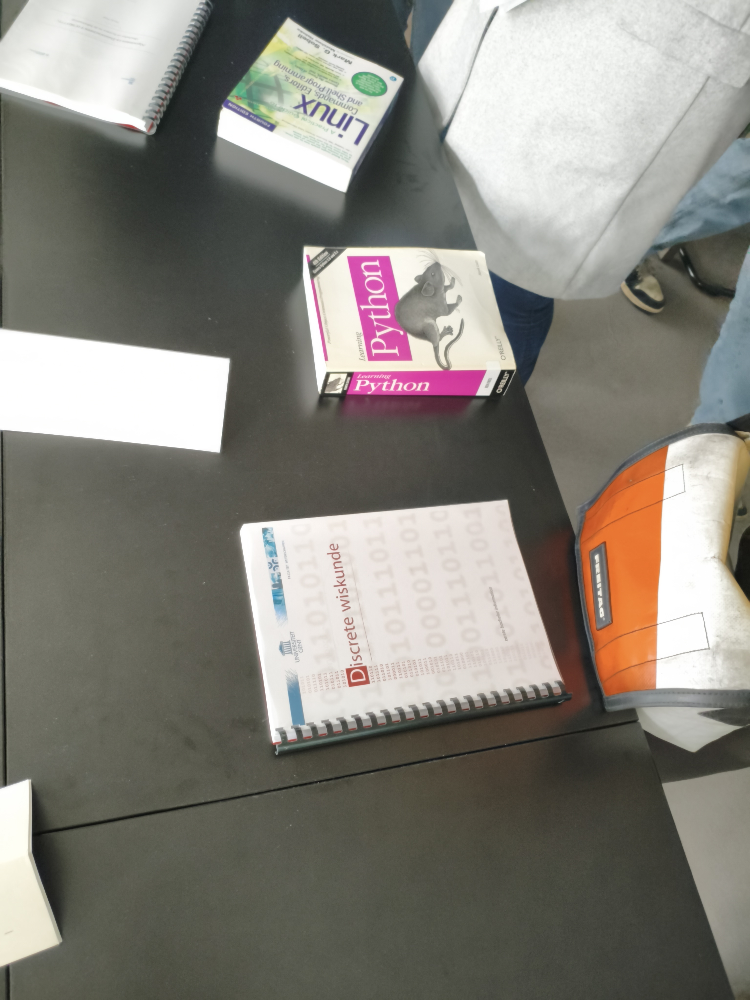

## Info days

https://www.ugent.be/nl/opleidingen/bacheloropleidingen/studiekeuze/infodagen

## Visits

### **2. ВІЗИТ ДО КАМПУСУ В КОРТРЕЙКУ (лише для програм промислової інженерії в Кортрейку - додатково до інформаційного дня)**

[x] 7 березня 2026 р. з 10:00 до 12:30 ( на території кампусу, місцезнаходження: Campus Tweekerken, Tweekerkenstraat 2, Ghent )

[-] 13 березня 2026 року безперервно з 16:00 до 20:00 ( На території кампусу, місце розташування: Campus Kortrijk, Graaf Karel de Goedelaan 46, Campus Building KUBES, 8500 Kortrijk ) ( **Industrial Engineer Kortrijk: Machine and Production Automation - Industrial Design** )  

[ ] 25 квітня 2026 безперервно з 09:00 до 13:00 ( На кампусі, місцезнаходження: Campus Kortrijk, Building A, Sint-Martens-Latemlaan 2B, Kortrijk ) ( **Industrial Engineer Kortrijk: Machine and Production Automation - Industrial Design** )     [Реєстрація](https://oasis.ugent.be/oasis-web/registratie?target=infodagen&infodag=312703005)

[ ] 30 червня 2026 року безперервно з 16:00 до 20:00 ( На кампусі, місцезнаходження: Campus Kortrijk, Building A, Sint-Martens-Latemlaan 2B, Kortrijk ) ( **Industrial Engineer Kortrijk: Machine and Production Automation - Industrial Design** )     [Реєстрація](https://oasis.ugent.be/oasis-web/registratie?target=infodagen&infodag=312699546)

## TODO:
Put photos and info books
Take from OneNote

## 2026-03-13 visited in Gent 
### **Informatica**

  
  
  
  
  

